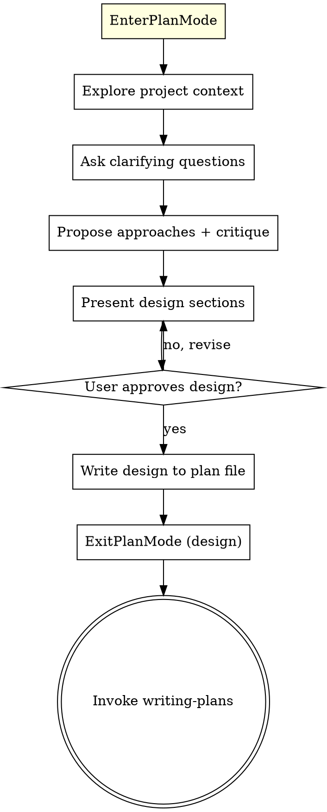

# Brainstorming Ideas Into Designs

## Overview

Help turn ideas into fully formed designs and specs through natural collaborative dialogue.

Enter plan mode immediately, explore the project context, ask questions one at a time to refine the idea, critique proposed approaches, and present the design for user approval — all within plan mode. No project files are created.

<HARD-GATE>
Do NOT invoke any implementation skill, write any code, scaffold any project, or take any implementation action until you have presented a design and the user has approved it via ExitPlanMode. This applies to EVERY project regardless of perceived simplicity.
</HARD-GATE>

## Anti-Pattern: "This Is Too Simple To Need A Design"

Every project goes through this process. A todo list, a single-function utility, a config change — all of them. "Simple" projects are where unexamined assumptions cause the most wasted work. The design can be short (a few sentences for truly simple projects), but you MUST present it and get approval.

## Checklist

You MUST create a task for each of these items and complete them in order:

1. **Enter plan mode** — call `EnterPlanMode` immediately
2. **Explore project context** — check files, docs, recent commits
3. **Ask clarifying questions** — one at a time, understand purpose/constraints/success criteria
4. **Propose 2-3 approaches with critique** — trade-offs, recommendation, and Risks per approach
5. **Present design** — in sections scaled to their complexity, get user approval after each section
6. **Finalize design in plan file** — write to `.claude/plans/*.md`
7. **Exit plan mode** — call `ExitPlanMode` for user approval
8. **Invoke writing-plans** — after design approval, invoke `superpowers:writing-plans` to create the detailed implementation plan

## Process Flow

**The terminal state is invoking `writing-plans`.** After design approval via `ExitPlanMode`, immediately invoke `superpowers:writing-plans` to create the detailed implementation plan. This triggers a second plan mode cycle for the implementation plan.

## The Process

**Understanding the idea:**
- Enter plan mode first — the entire brainstorming flow happens inside plan mode
- Check out the current project state (files, docs, recent commits)
- Ask questions one at a time to refine the idea
- Prefer multiple choice questions when possible, but open-ended is fine too
- Only one question per message - if a topic needs more exploration, break it into multiple questions
- Focus on understanding: purpose, constraints, success criteria

**Exploring approaches (Devil's Advocate):**
- Propose 2-3 different approaches with trade-offs
- Lead with your recommended option and explain why
- **For each approach, include a "Risks:" section** — actively critique the approach:
  - Find 2-3 weaknesses, edge cases, or potential failures
  - Check for: over-engineering, hidden complexity, scalability traps, wrong abstraction level, YAGNI violations
  - Be honest about what could go wrong — don't just present approaches positively
- Present risks alongside each approach so the user makes an informed choice

**Presenting the design:**
- Once you believe you understand what you're building, present the design
- Scale each section to its complexity: a few sentences if straightforward, up to 200-300 words if nuanced
- Ask after each section whether it looks right so far
- Cover: architecture, components, data flow, error handling, testing
- Be ready to go back and clarify if something doesn't make sense

**Finalizing:**
- Write the approved design to the plan file (`.claude/plans/*.md`)
- Call `ExitPlanMode` — no files are created in the project
- After user approves: invoke `superpowers:writing-plans` to create the detailed implementation plan

## Key Principles

- **One question at a time** - Don't overwhelm with multiple questions
- **Multiple choice preferred** - Easier to answer than open-ended when possible
- **YAGNI ruthlessly** - Remove unnecessary features from all designs
- **Critique before choosing** - Present risks for each approach before asking user to choose
- **Incremental validation** - Present design, get approval before moving on
- **Be flexible** - Go back and clarify when something doesn't make sense
- **No project files** - Everything stays in the plan file until implementation begins
- **Design then plan** - After design approval, always proceed to writing-plans for the detailed implementation plan
