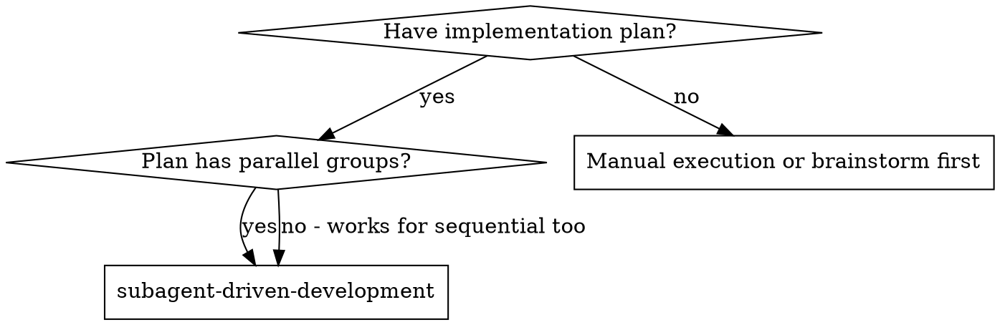
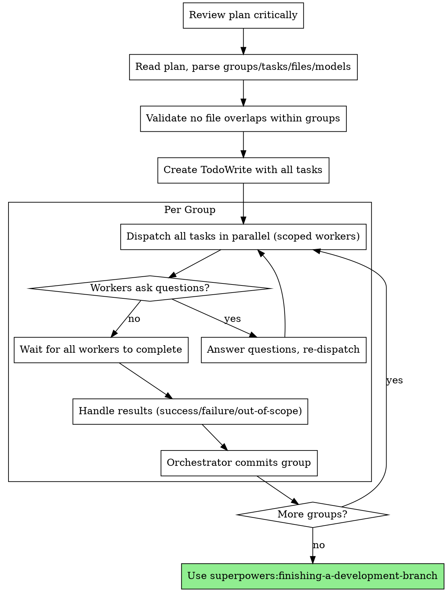

# Subagent-Driven Development

Execute plan by dispatching parallel groups of scoped worker subagents with per-task model selection.

**Core principle:** Parallel dispatch per group + scoped workers + orchestrator commits = fast, conflict-free execution.

## When to Use



## The Process



## Prompt Template

- `./scoped-worker-prompt.md` — Dispatch scoped worker subagent

## Step-by-Step

### 1. Review Plan Critically

Read the plan file. Before parsing tasks, review the plan as a whole:
- Does the architecture make sense?
- Are there gaps or ambiguities?
- Do the parallel groups look correctly organized?

**If concerns:** Raise them with the user before proceeding.
**If no concerns:** Continue to step 2.

### 2. Parse the Plan

Read the plan file once. Extract:
- All groups with their tasks
- Per task: full text, file lists, model annotation, dependencies
- Store everything — workers get full task text, not file references

### 3. Validate Groups

For each group, verify no two tasks share a write file. If overlap found:
- Stop and warn the user
- Suggest moving conflicting task to next group

### 4. Create TodoWrite

Create a TodoWrite entry for every task across all groups.

### 5. Execute Group

Dispatch ALL tasks in the group as parallel Task agents in a single message:

```
Task("Implement Task 1.1: Create user model",
  model: "haiku",
  subagent_type: "general-purpose",
  prompt: [filled scoped-worker-prompt.md])

Task("Implement Task 1.2: Create auth middleware",
  model: "sonnet",
  subagent_type: "general-purpose",
  prompt: [filled scoped-worker-prompt.md])
// Both run concurrently
```

Fill in the scoped-worker-prompt.md template for each task:
- `{N.M}` and `{task name}` from plan
- `{file list}` from task's Files: section
- `{FULL TEXT}` — paste the entire task description
- `{context}` — where this fits, what prior groups produced
- `{model}` — haiku/sonnet/opus from plan annotation

### 6. Collect Results

Wait for all agents. Categorize each result:

- **Success** — collect, mark task complete in TodoWrite
- **Failure** — orchestrator diagnoses. Either fix directly or re-dispatch worker with more context. After 2 failures on the same task, handle manually or ask user.
- **Out-of-scope request** — if small (<5 lines): orchestrator fixes directly. If significant: create a follow-up task in the next group.

### 7. Commit Group

```bash
git add {all files from this group's tasks}
git commit -m "{type}: {brief summary of what was built}"
```

One commit per group. Orchestrator handles all git.

### 8. Next Group

Move to the next group. Repeat from step 5.

### 9. Finish

After all groups complete:
- **REQUIRED SUB-SKILL:** Use superpowers:finishing-a-development-branch

## Example Workflow

```
You: I'm using Subagent-Driven Development to execute this plan.

[Read plan file once: docs/plans/feature-plan.md]
[Parse 2 groups: Group 1 has Tasks 1.1 + 1.2, Group 2 has Task 2.1]
[Create TodoWrite with all 3 tasks]

Group 1: (2 tasks in parallel)

[Dispatch Task 1.1 worker: model haiku, files: src/models/user.py, tests/models/test_user.py]
[Dispatch Task 1.2 worker: model sonnet, files: src/middleware/auth.py, tests/middleware/test_auth.py]
// Both run concurrently

Worker 1.1: "Before I begin - should UserModel use dataclass or Pydantic?"
Worker 1.2: [No questions, proceeds]

You: "Pydantic BaseModel"

[Re-dispatch Worker 1.1 with answer]

Worker 1.1:
  - Success: created user model with Pydantic
  - Files: src/models/user.py, tests/models/test_user.py
  - Tests: 4/4 passing

Worker 1.2:
  - Success: created auth middleware
  - Files: src/middleware/auth.py, tests/middleware/test_auth.py
  - Tests: 6/6 passing

[git add + commit: "feat: add user model and auth middleware"]
[Mark Tasks 1.1, 1.2 complete]

Group 2: (1 task)

[Dispatch Task 2.1 worker: model sonnet, files: src/routes/login.py, tests/routes/test_login.py]

Worker 2.1:
  - Success: added login endpoint
  - Tests: 5/5 passing

[git add + commit: "feat: add login endpoint"]
[Mark Task 2.1 complete]

[All groups done → finishing-a-development-branch]
```

## Red Flags

**Never:**
- Start implementation on main/master branch without explicit user consent
- Dispatch workers without filling in the scoped-worker-prompt.md template completely
- Let workers run git commands (orchestrator only)
- Proceed if file overlap detected within a group
- Re-dispatch indefinitely — 2 failures max per task, then escalate
- Skip TodoWrite tracking
- Let workers commit (orchestrator commits per group)
- Make workers read plan file (provide full text instead)

**If worker asks questions:**
- Answer clearly and completely
- Provide additional context if needed
- Re-dispatch with answers

**If worker returns out-of-scope request:**
- Small fix: orchestrator handles directly
- Large fix: new task in next group
- Never tell worker to widen its scope

**If worker fails:**
- Read failure report
- Provide more context or fix the blocker
- Re-dispatch (max 2 attempts)
- After 2 failures: handle manually or ask user

## Integration

**Required workflow skills:**
- **superpowers:writing-plans** — Creates the plan this skill executes
- **superpowers:finishing-a-development-branch** — Complete development after all tasks

**Workers should follow:**
- **superpowers:test-driven-development** — Workers follow TDD for each task
